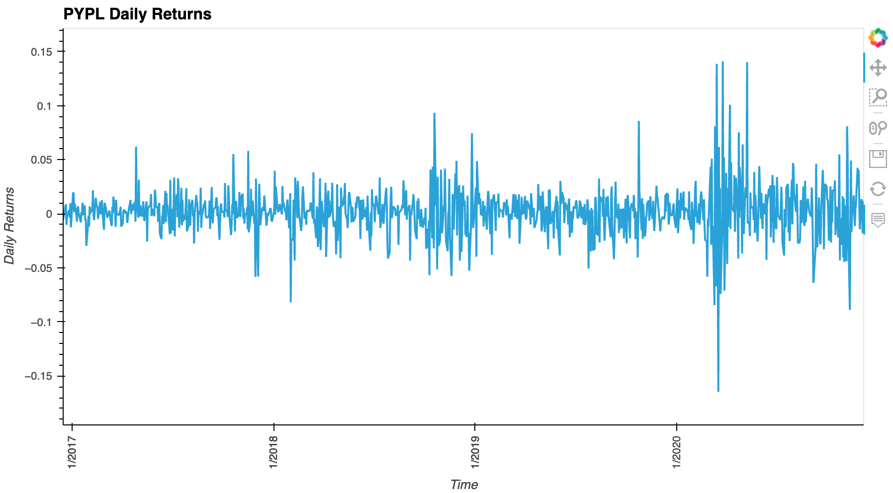
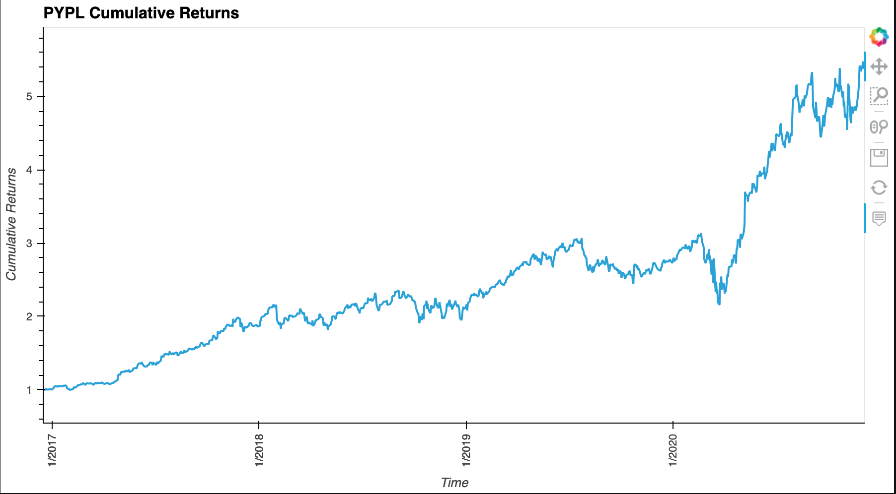
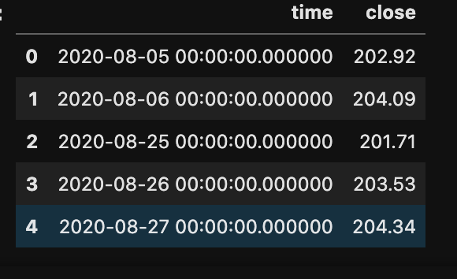
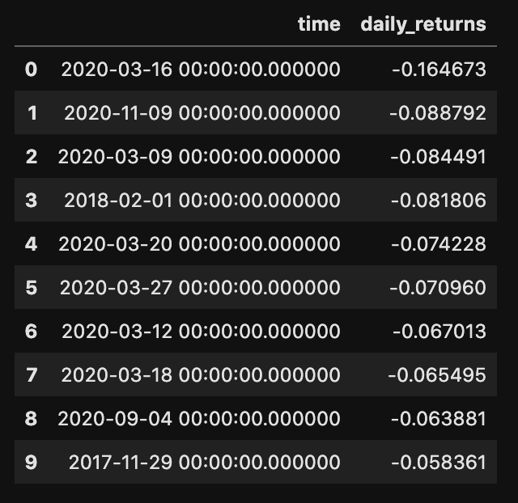
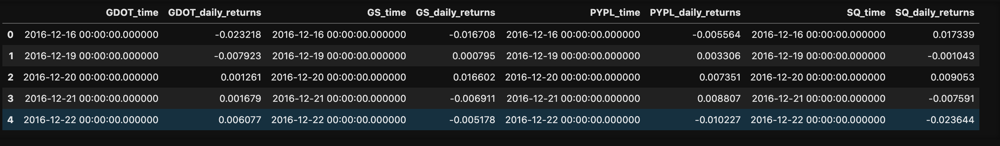
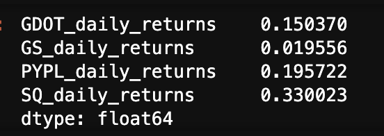
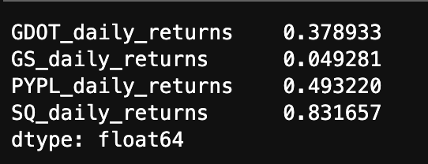
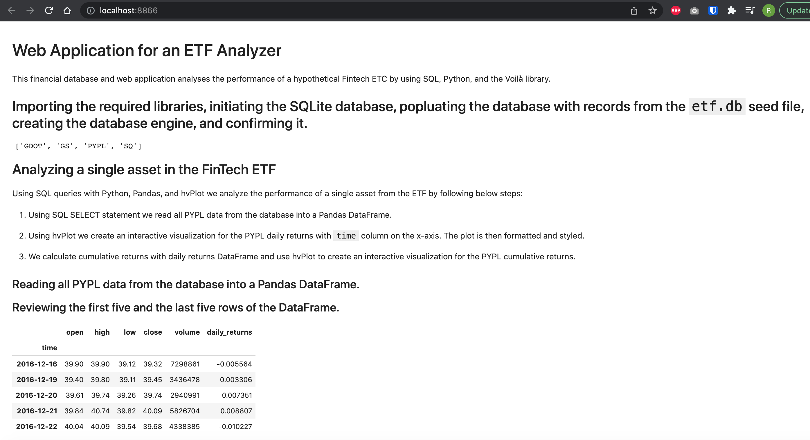

# ETF_Analysis_Web_Wpplication
   This financial database and web application analyses the performance of a hypothetical Fintech ETC by using SQL, Python, and the Voilà library.
   
---

## Technologies

This application works on python 3.7 and uses following libraries:

* [hvplot](https://pyviz-dev.github.io/hvplot/index.html) - A component of PyViz ecosystem used for creating Interactive Visualizations of data.
* [sqlalchemy](https://www.sqlalchemy.org/) - SQLAlchemy is an open-source SQL library for Python which ease the communication between Python-based programs and databases.
* [voila](https://voila.readthedocs.io/en/stable/index.html) - A Python library which is used convert a Jupyter notebook into a live webpage.

---

## Installation Guide

Follow the following instructions before using the application.

```python 
  conda install -c pyviz hvplot
  conda install -c conda-forge voila
    
  pip install SQLAlchemy
```
---

## Analyzing a Single Asset in the ETF

Using SQL queries with Python, Pandas, and hvPlot we analyze the performance of a single asset from the ETF.

1. Using SQL SELECT statement we read all PYPL data from the database into a Pandas DataFrame.

2. Using hvPlot we create an interactive visualization for the PYPL daily returns with `time` column on the x-axis. The plot is then formatted and styled.

3. We calculate cumulative returns with daily returns DataFrame and use hvPlot to create an interactive visualization for the PYPL cumulative returns.
    
   

   
    
---

## Optimizing Data Access with Advanced SQL Queries

Using advanced SQL queries we optimize the efficiency of accessing data from the database. Here we use single asset (PYPL) from the ETF

1. Accessing the closing prices for PYPL that are greater than 200:
   
  Create a Pandas DataFrame using SQL SELECT statement to select “time” and “close” columns of the dates where the PYPL closing price was higher than 200

   

2. Finding the top 10 daily returns for PYPL table:
   
  Create a Pandas DataFrame using SQL SELECT, ORDER and LIMIT statements to select “time” and “close” columns of top 10 PYPL daily returns.

   
   
---

## Analyzing the ETF Portfolio
Using SQL joins we combine all the data for each asset and build the entire ETF portfolio and then evaluate its performance by following steps below:

1. Writing a SQL query to join each table in the portfolio into a single DataFrame using SQL inner join to join each table on the “time” column.

   

2. Creating a DataFrame that averages the “daily_returns” columns for all four assets.

    

3. Using the average daily returns in the etf_portfolio_returns DataFrame we calculate the annualized returns for the portfolio.

    

4. Using the average daily returns in the etf_portfolio_returns DataFrame we calculate the cumulative returns of the ETF portfolio.

5. Using hvPlot we create an interactive line plot that visualizes the cumulative return values of the ETF portfolio. 
   
   
    
---

## Deploying the Notebook as a Web Application¶

Using the Voila library we deploy the notebook as a web application locally in our computer.

Screen recording or screenshots of how the web application appears when using Voilà is included below:

   
   
   
